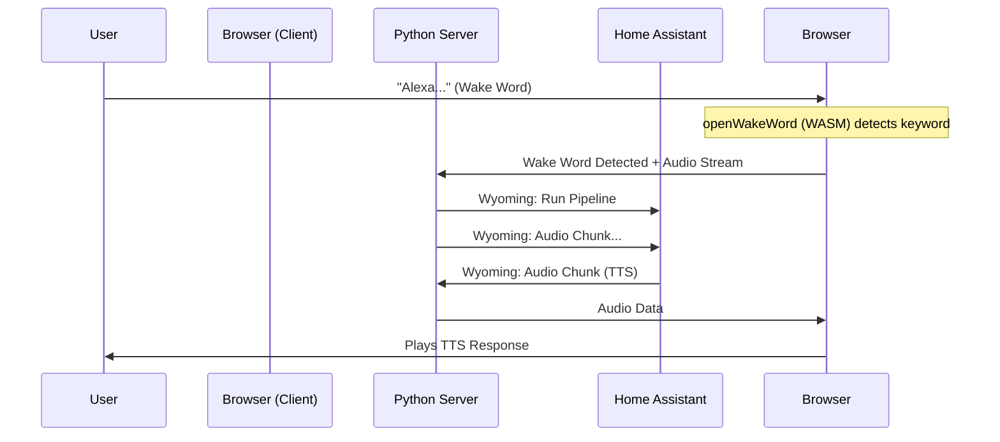

# Hybrid Voice Satellite 🛰️

A zero-hardware **Voice Satellite** for Home Assistant that runs entirely in your browser, backed by a lightweight Python relay server.

**Why "Hybrid"?**
- **Client (Browser)**: Handles Wake Word detection (openWakeWord) locally via WASM. No audio is sent to the server until the wake word is detected.
- **Server (Python)**: Acts as a bridge. It receives the audio stream via WebSocket and forwards it to Home Assistant using the **Wyoming Protocol**. It also plays back TTS audio.

## Features
- 🗣️ **Wake Word runs locally in-browser** (No constant server streaming).
- 🔌 **Wyoming Protocol** native integration (Works like any standard satellite).
- 🔊 **Crystal Clear Audio**: 16kHz upstream, 22kHz downstream with intelligent buffering.
- 🔒 **Secure**: HTTPS/WSS enabled for microphone access.
- 🚀 **Zero Hardware**: Use any old phone, tablet, or laptop as a voice assistant.

## Architecture



## Quick Start

### 1. Requirements
- Python 3.11+
- A modern browser (Chrome, Firefox, Safari)
- Microphone access

### 2. Setup

Use the included setup script to prepare the environment and SSL certificates.

```bash
./setup.sh
```

### 3. Configuration

Edit `server/config.yaml` with your Home Assistant details:

```yaml
server:
  host: 0.0.0.0
  port: 8765
  auth_token: "my-secret-token" # Token for the browser client

wyoming:
  host: 0.0.0.0
  port: 10700

home_assistant:
  host: 192.168.1.100
  port: 3000   # Not used directly (We use Wyoming connection from HA side)
```

**Note:** You must configure Home Assistant to connect to this satellite via the **Wyoming Integration**.
- Go to HA -> Integrations -> Add Integration -> Wyoming Protocol.
- host: `IP_OF_THIS_SERVER`, port: `10700`.

### 4. Run

Start the server:

```bash
cd server
source venv/bin/activate
python main.py
```

### 5. Client Interfaces

The satellite provides two interfaces:

#### 1. Inspector Dashboard (`/index.html`)
- **URL**: `https://localhost:8765`
- **Purpose**: Main control panel for monitoring and debugging.
- **Features**:
  - Live microphone visualizer.
  - Connection status indicators (Wyoming, WebSocket, Mic).
  - Wake Word selection.
  - Debug logs.

#### 2. Voice Overlay (`/overlay.html`)
- **URL**: `https://localhost:8765/overlay.html`
- **Purpose**: A minimalist floating interface designed to run on top of a Home Assistant dashboard.
- **Features**:
  - **Background Iframe**: Loads your Home Assistant dashboard (or any URL) in the background.
  - **Floating Action Button (FAB)**: Tap to activate voice, or just say the wake word.
  - **Settings (⚙️)**: Click the gear icon to configure the **Overlay URL** directly in the browser.

---

## Advanced Configuration: HTTP & Iframes

If you want to embed Home Assistant in the overlay iframe without mixed-content warnings or security blocks, you may need to run the satellite in **HTTP mode** (no SSL) and adjust Home Assistant settings.

### 1. Disable SSL on the Satellite
Edit `server/config.yaml`:
```yaml
server:
  ssl: false  # Disable HTTPS
```
*Note: Browsers normally block microphone access on insecure HTTP. See "Troubleshooting" below for the fix.*

### 2. Configure Home Assistant for Iframes
To allow Home Assistant to be displayed inside the satellite's iframe, add this to your Home Assistant `configuration.yaml`:

```yaml
http:
  use_x_frame_options: false
```
*Restart Home Assistant after changing this setting.*

---

## Troubleshooting

- **No Audio / Microphone Error**:
  - **HTTPS**: Ensure you are using `https://` if SSL is enabled.
  - **HTTP (No SSL)**: If using `http://`, Chrome will block the mic unless you add an exception:
    1. Go to `chrome://flags/#unsafely-treat-insecure-origin-as-secure`
    2. Enable it.
    3. Add your satellite URL (e.g., `http://192.168.1.100:8765`) to the list.
    4. Relaunch Chrome.

- **"Demon Voice" (Slow Audio)**:
  - Fixed! The client automatically handles sample rate conversion.

- **Iframe Refused to Connect**:
  - Ensure `use_x_frame_options: false` is set in Home Assistant.
  - Ensure you are not mixing HTTPS (Satellite) with HTTP (Home Assistant). Ideally, make them match, or use the HTTP setup above.


## License

This project is licensed under the MIT License - see the [LICENSE](LICENSE) file for details.

## Disclaimer

⚠️ **AI Generated Code**

This project was developed with the assistance of AI Agents. While the code has been tested and verified to work, please review it carefully before deploying in production environments.
