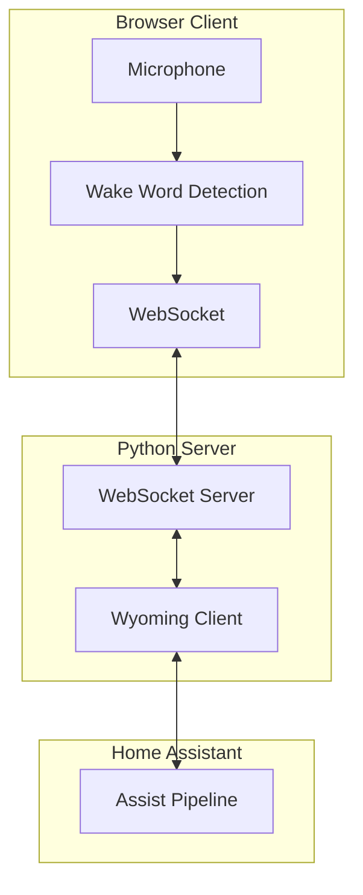

# Hybrid Voice Satellite for Home Assistant

A browser-based voice satellite system that brings Home Assistant's voice control to any device with a web browser. Features local wake word detection and seamless integration with Home Assistant's Assist Pipeline.

> [!WARNING]
> **🚧 Work in Progress 🚧**
> 
> This project is currently in active development. Core functionality (Wake Word -> HA -> Audio Response) works, but audio quality tuning is ongoing.
> 
> **Known Issues:**
> - TTS Audio playback may be distorted (pitch/speed issues) due to sample rate mismatches (Client 16kHz vs Server 22/24kHz).
> - Work is underway to implement server-side `ffmpeg` conversion for consistent audio quality.

## 🎯 Features

- **Browser-Based Voice Control**: Turn any device into a voice satellite using just a web browser
- **Local Wake Word Detection**: Privacy-first wake word processing using openWakeWord (ONNX) in the browser
- **Low Latency**: Real-time audio streaming optimized for <100ms response time on LAN
- **Wyoming Protocol**: Native integration with Home Assistant's voice ecosystem
- **Zero Installation**: No apps to install - just open a webpage
- **Maximum Privacy**: Audio only transmitted after wake word detection
- **Multi-Client Support**: Multiple browsers can connect simultaneously

## 📐 Architecture



**Data Flow:**
1. Browser detects wake word locally (openWakeWord via ONNX)
2. Audio streams to Python server via WebSocket
3. Server forwards to Home Assistant via Wyoming protocol
4. HA processes through Assist Pipeline (STT → Intent → TTS)
5. TTS audio streams back to browser for playback

## 🚀 Quick Start

### Prerequisites

- Python 3.11 or higher
- Home Assistant with Assist Pipeline configured
- Modern web browser (Chrome, Firefox, Safari)

### Installation

1. **Clone the repository:**
   ```bash
   git clone https://github.com/yourusername/hybrid-voice-satellite.git
   cd hybrid-voice-satellite
   ```

2. **Setup Python server:**
   ```bash
   cd server
   python3 -m venv venv
   source venv/bin/activate  # On Windows: venv\Scripts\activate
   pip install -r requirements.txt
   ```

3. **Configure the server:**
   Edit `server/config.yaml` with your Home Assistant details:
   ```yaml
   home_assistant:
     host: "homeassistant.local"  # Your HA hostname/IP
     port: 10700
   ```

4. **Start the server:**
   ```bash
   python main.py
   ```

5. **Open the client:**
   - For testing: Open `client/index.html` in your browser (HTTPS required for microphone)
   - For production: Serve via HTTPS (see deployment section)

## ⚙️ Configuration

### Server Configuration (`server/config.yaml`)

```yaml
server:
  host: "0.0.0.0"
  port: 8765
  auth_token: "your-secure-token"  # Change in production!

home_assistant:
  host: "homeassistant.local"
  port: 10700

audio:
  sample_rate: 16000
  channels: 1
  chunk_duration_ms: 30

logging:
  level: "INFO"
  file: "hybrid-satellite.log"
```

### Client Configuration

Wake word can be changed in `client/app.js`:
```javascript
const WAKE_WORD = 'ok_nabu';  // Options: ok_nabu, alexa, hey_jarvis, hey_rhasspy
```

## 🐳 Docker Deployment

```bash
docker-compose up -d
```

This starts both server and client with HTTPS enabled.

## 🔒 Security

- **HTTPS Required**: Browsers require HTTPS for microphone access
- **Authentication**: WebSocket connections use token authentication
- **Local Processing**: Wake word detection happens entirely in the browser
- **Privacy First**: Audio only sent after wake word is detected

## 🛠️ Development

### Running Tests

**Python tests:**
```bash
cd server
pytest tests/
```

**JavaScript tests:**
```bash
cd client
npm test
```

### Project Structure

```
hybrid-voice-satellite/
├── client/              # Browser-based client
│   ├── index.html      # Main HTML interface
│   ├── app.js          # Core application logic
│   ├── wake-word-processor.js  # AudioWorklet processor
│   ├── styles.css      # UI styling
│   └── models/         # ONNX wake word models
├── server/             # Python server
│   ├── main.py         # Entry point
│   ├── websocket_server.py  # WebSocket server
│   ├── wyoming_client.py    # Wyoming protocol client
│   ├── audio_buffer.py      # Audio buffering
│   ├── config.yaml     # Configuration
│   └── requirements.txt
└── docker-compose.yml
```

## 🧩 Integration with Home Assistant

1. **Enable Wyoming integration** in Home Assistant:
   - Settings → Devices & Services → Add Integration → Wyoming Protocol
   - Host: Your server's IP
   - Port: 10700

2. **Configure Assist Pipeline:**
   - Settings → Voice Assistants → Add Assistant
   - Configure STT (e.g., Whisper) and TTS (e.g., Piper)

3. **Test the satellite:**
   - Open the client in your browser
   - Say the wake word (default: "OK Nabu")
   - Speak your command

## 📚 Credits

This project builds upon:
- **[linux-voice-assistant](https://github.com/OHF-Voice/linux-voice-assistant)**: ESPHome protocol patterns and server architecture
- **[voice-satellite-card](https://github.com/emme99/voice-satellite-card)**: Browser-based wake word detection implementation
- **[openWakeWord](https://github.com/dscripka/openWakeWord)**: Wake word detection models (MIT License)
- **Wyoming Protocol**: Home Assistant's voice satellite protocol

## 📄 License

MIT License - See LICENSE file for details

## 🤝 Contributing

Contributions welcome! Please open an issue or pull request.

## 🐛 Troubleshooting

### Microphone not working
- Ensure you're using HTTPS (required for microphone access)
- Check browser permissions for microphone access
- Verify audio sample rate is 16kHz

### Connection issues
- Check WebSocket server is running (`server/main.py`)
- Verify firewall allows port 8765
- Check Home Assistant Wyoming integration is configured

### Wake word not detected
- Speak clearly and at normal volume
- Ensure correct wake word model is loaded
- Check browser console for ONNX errors

### High latency
- Verify LAN connection (WiFi can add latency)
- Check server logs for processing delays
- Reduce `chunk_duration_ms` in config if needed

---

**Built with ❤️ for the Home Assistant community**
