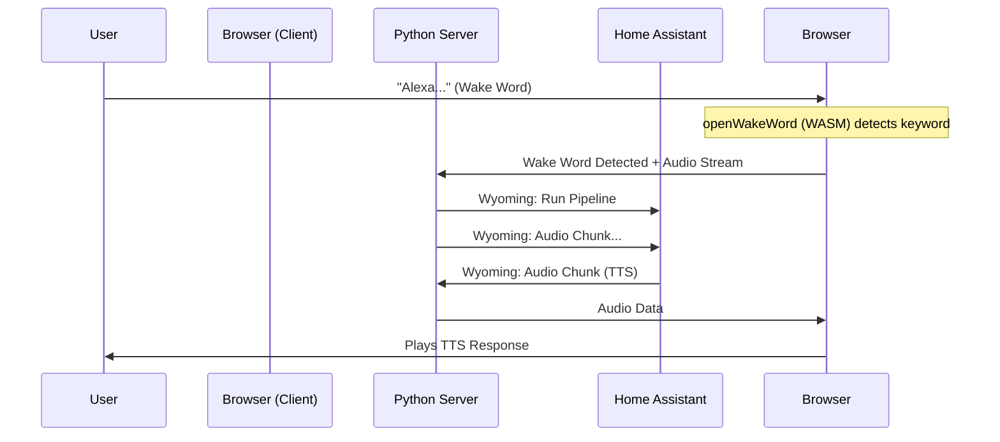

# Hybrid Voice Satellite 🛰️

A zero-hardware **Voice Satellite** for Home Assistant that runs entirely in your browser, backed by a lightweight Python relay server.

**Why "Hybrid"?**
- **Client (Browser)**: Handles Wake Word detection (openWakeWord) locally via WASM. No audio is sent to the server until the wake word is detected.
- **Server (Python)**: Acts as a bridge. It receives the audio stream via WebSocket and forwards it to Home Assistant using the **Wyoming Protocol**. It also plays back TTS audio.

## Features
- 🗣️ **Wake Word runs locally in-browser** (No constant server streaming).
- 🔌 **Wyoming Protocol** native integration (Works like any standard satellite).
- 🔊 **Crystal Clear Audio**: 16kHz upstream, 22kHz downstream with intelligent buffering.
- 🔒 **Secure**: HTTPS/WSS enabled for microphone access.
- 🚀 **Zero Hardware**: Use any old phone, tablet, or laptop as a voice assistant.

## Architecture



## Quick Start

### 1. Requirements
- Python 3.11+
- A modern browser (Chrome, Firefox, Safari)
- Microphone access

### 2. Setup

Use the included setup script to prepare the environment and SSL certificates.

```bash
./setup.sh
```

### 3. Configuration

Edit `server/config.yaml` with your Home Assistant details:

```yaml
server:
  host: 0.0.0.0
  port: 8765
  auth_token: "my-secret-token" # Token for the browser client

wyoming:
  host: 0.0.0.0
  port: 10700

home_assistant:
  host: 192.168.1.100
  port: 3000   # Not used directly (We use Wyoming connection from HA side)
```

**Note:** You must configure Home Assistant to connect to this satellite via the **Wyoming Integration**.
- Go to HA -> Integrations -> Add Integration -> Wyoming Protocol.
- host: `IP_OF_THIS_SERVER`, port: `10700`.

### 4. Run

Start the server:

```bash
cd server
source venv/bin/activate
python main.py
```

### 5. Connect Client

Open your browser and navigate to:
`https://localhost:8765` (or your server's IP).

*Note: Since we use self-signed certificates, you'll see a security warning. Click "Advanced" -> "Proceed" to accept it.*

## Troubleshooting

- **No Audio / Microphone Error**: Ensure you are using **HTTPS**. Browsers block mic access on insecure HTTP (except localhost).
- **"Demon Voice" (Slow Audio)**: Fixed! The client automatically handles sample rate conversion.
- **Connection Error**: Check `server/config.yaml` and ensure port 8765 is open.

## Disclaimer

⚠️ **AI Generated Code**

This project was developed with the assistance of AI Agents. While the code has been tested and verified to work, please review it carefully before deploying in production environments.
